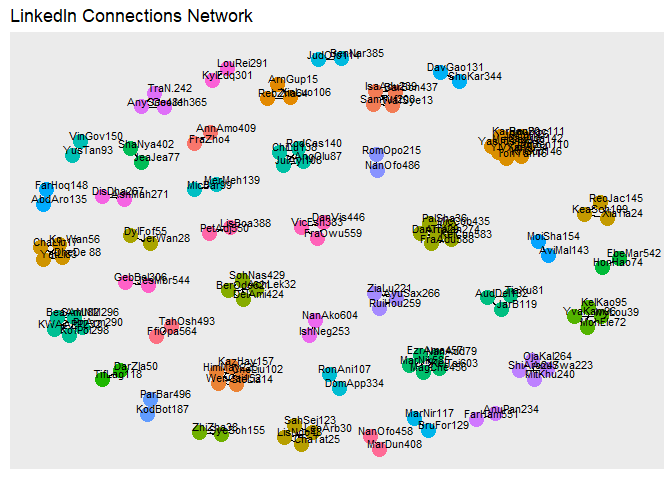

``` r
library(readr)
library(igraph)
```

    ## 
    ## Attaching package: 'igraph'

    ## The following objects are masked from 'package:stats':
    ## 
    ##     decompose, spectrum

    ## The following object is masked from 'package:base':
    ## 
    ##     union

``` r
library(ggraph)
```

    ## Loading required package: ggplot2

``` r
library(tidyverse)
```

    ## ── Attaching core tidyverse packages ──────────────────────── tidyverse 2.0.0 ──
    ## ✔ dplyr     1.1.3     ✔ stringr   1.5.0
    ## ✔ forcats   1.0.0     ✔ tibble    3.2.1
    ## ✔ lubridate 1.9.3     ✔ tidyr     1.3.0
    ## ✔ purrr     1.0.2

    ## ── Conflicts ────────────────────────────────────────── tidyverse_conflicts() ──
    ## ✖ lubridate::%--%()      masks igraph::%--%()
    ## ✖ dplyr::as_data_frame() masks tibble::as_data_frame(), igraph::as_data_frame()
    ## ✖ purrr::compose()       masks igraph::compose()
    ## ✖ tidyr::crossing()      masks igraph::crossing()
    ## ✖ dplyr::filter()        masks stats::filter()
    ## ✖ dplyr::lag()           masks stats::lag()
    ## ✖ purrr::simplify()      masks igraph::simplify()
    ## ℹ Use the conflicted package (<http://conflicted.r-lib.org/>) to force all conflicts to become errors

``` r
# Read data skipping first 3 lines and handle empty rows
connections <- read_csv("Connections_JessicaQuansah.csv", skip = 3)
```

    ## Rows: 660 Columns: 7
    ## ── Column specification ────────────────────────────────────────────────────────
    ## Delimiter: ","
    ## chr (7): First Name, Last Name, URL, Email Address, Company, Position, Conne...
    ## 
    ## ℹ Use `spec()` to retrieve the full column specification for this data.
    ## ℹ Specify the column types or set `show_col_types = FALSE` to quiet this message.

``` r
# Drop rows with empty surname and NA company
connections <- connections %>%
  drop_na(`First Name`, Company)

#Get the count of your contacts by their current employer + total count
table1<-connections %>% count(Company)
print(table1)
```

    ## # A tibble: 540 × 2
    ##    Company                                                 n
    ##    <chr>                                               <int>
    ##  1 1st Armored Division                                    1
    ##  2 360dialog — official WhatsApp Business API Provider     1
    ##  3 3H ENGINEERING AND CONSTRUCTION                         1
    ##  4 8 80  Cities                                            1
    ##  5 9.O The Underground Radio                               1
    ##  6 9to5                                                    1
    ##  7 AHC Appliances                                          1
    ##  8 AJ Bell                                                 1
    ##  9 AJS                                                     1
    ## 10 AKOFENA RENTALS LIMITED                                 1
    ## # ℹ 530 more rows

``` r
# Create unique identifiers for nodes
connections <- connections %>%
  mutate(id = paste(substr(`First Name`, 1, 3), substr(`Last Name`, 1, 3), row_number(), sep = ""))

# Create edges between nodes based on connections they share (same company)
edges <- connections %>%
  inner_join(connections, by = "Company") %>%
  filter(id.x != id.y) %>%
  select(from = id.x, to = id.y)
```

    ## Warning in inner_join(., connections, by = "Company"): Detected an unexpected many-to-many relationship between `x` and `y`.
    ## ℹ Row 4 of `x` matches multiple rows in `y`.
    ## ℹ Row 16 of `y` matches multiple rows in `x`.
    ## ℹ If a many-to-many relationship is expected, set `relationship =
    ##   "many-to-many"` to silence this warning.

``` r
# Remove duplicate edges - Removes people who have no connection to anyone
edges <- unique(edges)

# Create graph
g <- graph_from_data_frame(edges, directed = FALSE)

# Calculate the connected components of the graph
components <- clusters(g)
```

    ## Warning: `clusters()` was deprecated in igraph 2.0.0.
    ## ℹ Please use `components()` instead.
    ## This warning is displayed once every 8 hours.
    ## Call `lifecycle::last_lifecycle_warnings()` to see where this warning was
    ## generated.

``` r
# Generate unique colors for each connected component
unique_colors <- rainbow(length(components$membership))

# Create a named vector mapping each connected component to a unique color
component_colors <- setNames(unique_colors, components$membership)

# Create a color palette function to map connected components to colors
get_component_color <- function(component) {
  return(component_colors[component])
}


# Plot the graph with Fruchterman-Reingold layout
ggraph(g, layout = "fr") + 
  geom_edge_link() +
  geom_node_point(aes(colour = factor(components$membership)), size = 5) +  # Use connected component for color
  geom_node_text(aes(label = name), size = 3, nudge_x = 0.5, nudge_y = 0.3) +  # Adjust label position
  theme(legend.position = "none") +  # Remove legend
  labs(title = "LinkedIn Connections Network")
```



##Comments
